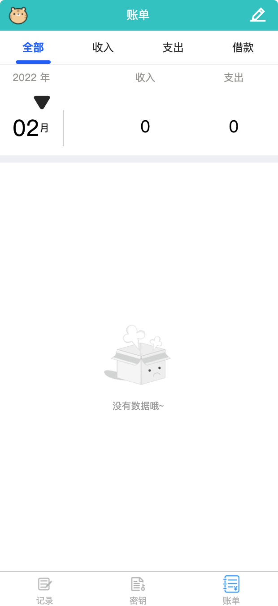

### 基本介绍

记事本app 用于记录自己平常的一些记录，自己的账号密码，平常消费的账单

前端基于uni-app开发，后端基于springBoot

### 详细介绍

  该项目分三个模块
1.  记录 
	1.1  用于自己平常记录一些容易忘记的事
	1.2  对自己明天的一个安排
	 等等
	
2.  密钥
2.1 平常自己注册网站，长时间不用可以先记录起来，方便以后查阅
2.2 自己的账号密码多了，人脑终归有限，先拿软件记起来
2.3 前后台数据都是密文，数据库中密码也是加密的

3.  账单
3.1 就是记录一下自己平常的消费，支出，收入，借款啥的 明细

 uview-ui
 z-paging
 zhouWei-APPUpdate
 male-editor
 v-tabs
 等等

### 预览

